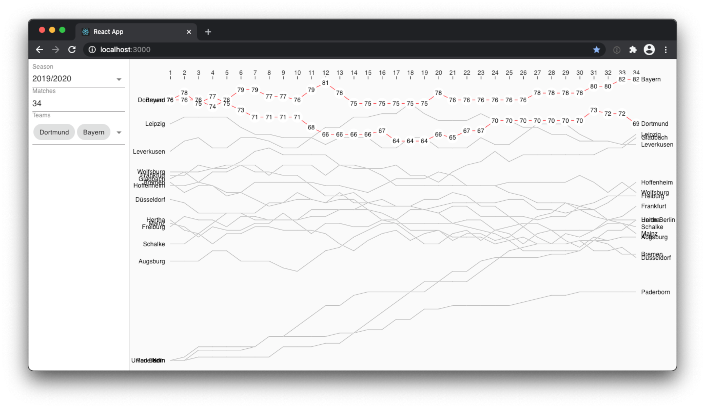

# open-season

This is a small dataviz project hacked together to answer the question: *When was the last time Bayern München was NOT the Bundesliga team with most points in the last 34 matches?* I didn't find this stat on any of the popular football websites.

(Answer: Actually not as long ago as you might expect, on round 4 of the 2019/2020 season.)

## resources and tools

* https://www.openligadb.de/ detailed data for every Bundesliga match
* **d3**, because it's the de facto standard for dataviz in javascript and I wanted to learn how to use it in combination with react. This project is mostly based on this example https://observablehq.com/@mbostock/cancer-survival-rates
* **react, react-use, material-ui**, just because I feel comfortable building stuff with these